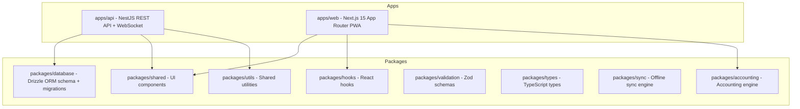

# Development

## Quick Start — 3 cách

### Cách 1: Docker (không cần setup)

```bash
git clone https://github.com/hieuck/Smart-ERP-Next.git
cd Smart-ERP-Next
docker compose up -d
# Mở http://localhost:3457
```

### Cách 2: Make (Linux/Mac/WSL)

```bash
pnpm install
make dev
# API: http://localhost:3456 | Web: http://localhost:3457
```

### Cách 3: Local dev (Windows, hot-reload)

```bash
dev.bat
```

**Mac/Linux:**
```bash
./scripts/dev.sh
```

```bash
git clone https://github.com/hieuck/Smart-ERP-Next.git
cd Smart-ERP-Next
./scripts/dev.sh
# API: http://localhost:3456 (hot-reload)
# Web: http://localhost:3457 (hot-reload)
```

---

## CI-equivalent local test

```bash
# Cần Docker (tự động start PostgreSQL)
.\scripts\ci-local.ps1    # Windows
./scripts/ci-local.sh      # Mac/Linux
```

Quy trình: fresh DB → migrate → seed → quality gate (lint + i18n + type-check + test) → build

---

## Chạy tests

```bash
# Unit + integration tests
pnpm test

# E2E tests (cần DB + API + Web đang chạy)
pnpm test:e2e

# Quality gate (chạy trước khi commit)
pnpm qa:commit
```

---

## Cấu trúc thư mục

```
smart-erp-next/
├── apps/
│   ├── api/          # NestJS API (port 3456)
│   └── web/          # Next.js web app (port 3457)
├── packages/
│   ├── shared/       # UI components, hooks, localization
│   ├── hooks/        # React hooks
│   ├── database/     # Drizzle schema, migrations, seed
│   ├── utils/        # Shared utilities
│   ├── validation/   # Zod validation schemas
│   ├── types/        # Shared TypeScript types
│   ├── sync/         # Offline-first sync engine
│   └── accounting/   # Accounting engine
├── e2e/              # Playwright E2E tests
├── scripts/          # Dev/CI scripts
└── .github/          # GitHub Actions workflows
```


